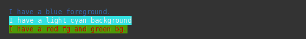
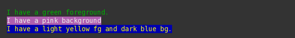
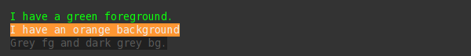

Coloring
========

Sty uses ANSI escape sequences for coloring. More about ANSI colors on wikipedia:
`3/4bit colors <https://en.wikipedia.org/wiki/ANSI_escape_code#3/4_bit>`__
| `8bit colors <https://en.wikipedia.org/wiki/ANSI_escape_code#8-bit>`__
| `24bit colors <https://en.wikipedia.org/wiki/ANSI_escape_code#24-bit>`__.

.. _anchor_color_register:

Sty's default color register
~~~~~~~~~~~~~~~~~~~~~~~~~~~~

Colors that use the :code:`sgr()` renderer are most widely supported.

.. _anchor_fg_register:

Foreground
----------

.. rst-class:: table-color-fg

============= ========= ======== =======================================
attribute     on light  on dark  default renderer
============= ========= ======== =======================================
fg.black      Example   Example  sgr(30)
fg.da_grey    Example   Example  sgr(90)
fg.grey       Example   Example  eightbit_fg(249)
fg.li_grey    Example   Example  sgr(37)
fg.white      Example   Example  sgr(97)
fg.li_red     Example   Example  sgr(91)
fg.red        Example   Example  sgr(31)
fg.da_red     Example   Example  eightbit_fg(88)
fg.li_green   Example   Example  sgr(92)
fg.green      Example   Example  sgr(32)
fg.da_green   Example   Example  eightbit_fg(22)
fg.li_yellow  Example   Example  sgr(93)
fg.yellow     Example   Example  sgr(33)
fg.da_yellow  Example   Example  eightbit_fg(58)
fg.li_blue    Example   Example  sgr(94)
fg.blue       Example   Example  sgr(34)
fg.da_blue    Example   Example  eightbit_fg(18)
fg.li_magenta Example   Example  sgr(95)
fg.magenta    Example   Example  sgr(35)
fg.da_magenta Example   Example  eightbit_fg(89)
fg.li_cyan    Example   Example  sgr(96)
fg.cyan       Example   Example  sgr(36)
fg.da_cyan    Example   Example  eightbit_fg(23)
fg.rs         Reset              sgr(39)
============= ========= ======== =======================================

.. _anchor_bg_register:

Background
----------

.. rst-class:: table-color-bg

============= ========= ======== =======================================
attribute     light     dark     default renderer
============= ========= ======== =======================================
bg.black      Example   Example  sgr(40)
bg.da_grey    Example   Example  sgr(100)
bg.grey       Example   Example  eightbit_bg(249)
bg.li_grey    Example   Example  sgr(47)
bg.white      Example   Example  sgr(107)
bg.li_red     Example   Example  sgr(101)
bg.red        Example   Example  sgr(41)
bg.da_red     Example   Example  eightbit_bg(88)
bg.li_green   Example   Example  sgr(102)
bg.green      Example   Example  sgr(42)
bg.da_green   Example   Example  eightbit_bg(22)
bg.li_yellow  Example   Example  sgr(103)
bg.yellow     Example   Example  sgr(43)
bg.da_yellow  Example   Example  eightbit_bg(58)
bg.li_blue    Example   Example  sgr(104)
bg.blue       Example   Example  sgr(44)
bg.da_blue    Example   Example  eightbit_bg(18)
bg.li_magenta Example   Example  sgr(105)
bg.magenta    Example   Example  sgr(45)
bg.da_magenta Example   Example  eightbit_bg(89)
bg.li_cyan    Example   Example  sgr(106)
bg.cyan       Example   Example  sgr(46)
bg.da_cyan    Example   Example  eightbit_bg(23)
bg.rs         Reset              sgr(49)
============= ========= ======== =======================================

Coloring by name
~~~~~~~~~~~~~~~~

.. literalinclude:: ../../sty/tests/docs/coloring.py
   :language: py
   :start-after: Example("coloring by name")
   :end-before: # ===== End

Coloring with 8-bit codes
~~~~~~~~~~~~~~~~~~~~~~~~~

Link:
`wikipedia:8bit <https://en.wikipedia.org/wiki/ANSI_escape_code#8-bit>`__

.. literalinclude:: ../../sty/tests/docs/coloring.py
   :language: py
   :start-after: Example("coloring by 8bit number")
   :end-before: # ===== End

Coloring with 24bit codes
~~~~~~~~~~~~~~~~~~~~~~~~~

Link:
`wikipedia:24bit <https://en.wikipedia.org/wiki/ANSI_escape_code#24-bit>`__

.. literalinclude:: ../../sty/tests/docs/coloring.py
   :language: py
   :start-after: Example("coloring by 24bit rgb number")
   :end-before: # ===== End

