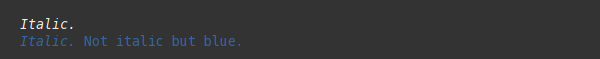
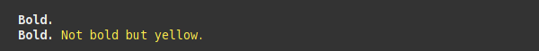
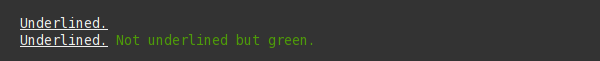

Effects
=======

Sty uses ANSI SGR parameters to apply effects. More about ANSI Select Graphic Rendition (SGR) on wikipedia:
`ANSI SGR <https://en.wikipedia.org/wiki/ANSI_escape_code#SGR_parameters>`__

.. _anchor_effect_register:

Sty's default effect register
~~~~~~~~~~~~~~~~~~~~~~~~~~~~~

These are the default attributes for the ``sty.ef`` register-object.

.. rst-class:: table-register

=================== ============================ =====================
Attribute           Description                  Default Renderer
=================== ============================ =====================
ef.bold (alias b)   Bold or increased intensity  sty.renderfunc.sgr(1)
ef.dim              Decreased intensity          sty.renderfunc.sgr(2)
ef.italic (alias i) Italic..                     sty.renderfunc.sgr(3)
ef.underl (alias u) Underline..                  sty.renderfunc.sgr(4)
ef.blink            Blink..                      sty.renderfunc.sgr(5)
ef.inverse          Inverse fore- and background sty.renderfunc.sgr(7)
ef.hidden           Conceal/Hide                 sty.renderfunc.sgr(8)
ef.strike           Strike-through               sty.renderfunc.sgr(9)
=================== ============================ =====================

Italic
~~~~~~

.. literalinclude:: ../../sty/tests/docs/effects.py
   :language: py
   :start-after: Example("italic")
   :end-before: # ===== End

Bold
~~~~

.. literalinclude:: ../../sty/tests/docs/effects.py
   :language: py
   :start-after: Example("bold")
   :end-before: # ===== End

Underline
~~~~~~~~~

.. literalinclude:: ../../sty/tests/docs/effects.py
   :language: py
   :start-after: Example("underline")
   :end-before: # ===== End

TODO:
~~~~~

Add examples for strike, blink, etc..

