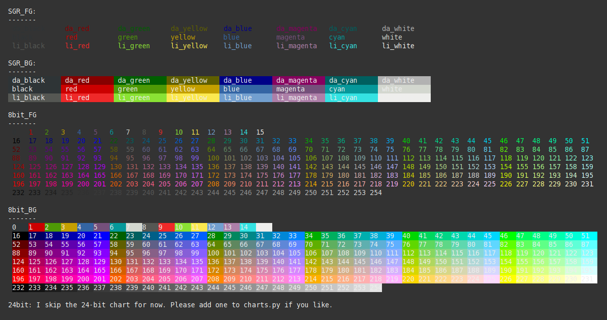

.. meta::
   :description: String styling for your terminal
   :keywords: sty, python, terminal, style, colors, coloring
   :author: Felix Meyer-Wolters

.. image:: ../assets/logo_readme.png
   :alt: charts

|

News
===========

Release 1.0.0-rc.1 (January 31. 2021)
-------------------------------------

* Sty is now fully typed.
* Deprecated methods `.set_style(...)` and `.get_style(...)` were finally removed.

`Release Note <https://github.com/feluxe/sty/releases/tag/1.0.0-rc.1>`__

Release 1.0.0-rc.0 (January 08. 2021)
-------------------------------------

Sty version `1.0.0` is now feature complete.

* I'm going to support Python version `>=3.7` indefinitely.
* Sty will follow `semver` so there won't be any breaking changes for version `1.x.x` after 1.0.0 was released.
* This is a pre-release (`rc.0`). I'll release `1.0.0` in a couple of month if no major bugs are reported.

`Breaking Changes <https://github.com/feluxe/sty/releases/tag/1.0.0-rc.0>`__

Description
===========

------------

Simple, flexible and extensible string styling for your terminal.
Supports 3/4bit, 8bit and 24bit (truecolor, rgb) colors. Should work on most
Unix platfroms with most terminals. Works with recent Windows terminals. Window
legacy terminal (cmd) needs a `shim <https://github.com/feluxe/sty/issues/2#issuecomment-501890699>`__ to work.

Sty comes with default color palettes and renderers, but you can easily
replace/customize them, without touching the markup.

Sty's goal is to provide Python with a little string styling markup, which
is decoupled from color palettes and terminal implementations.

Sty has no dependencies.

If you run into compatibility problems with sty, please file an `issue <https://github.com/feluxe/sty/issues>`__!

Code Example
============

------------

.. literalinclude:: ../sty/tests/docs/getting_started.py
   :language: py
   :start-after: Example("gettings started: sty all the strings")
   :end-before: # ===== End

The code above will print like this in the terminal:

.. image:: ../assets/example_so.png
   :alt: example usage

Demo
====

------------

Contents
========

------------

.. toctree::
   :maxdepth: 1
   :titlesonly:
   :caption: Source Files (github):

   Code Repo <https://github.com/feluxe/sty>
   Docs Repo <https://github.com/feluxe/sty-docs>

.. toctree::
   :maxdepth: 1
   :titlesonly:
   :caption: Introduction:

   intro/requirements.rst
   intro/install.rst
   intro/getting_started.rst

.. toctree::
   :maxdepth: 1
   :caption: Documentation:

   docs/effects.rst
   docs/coloring.rst
   docs/resetting.rst
   docs/muting.rst
   docs/customizing.rst
   docs/exporting.rst
   docs/developing_testing.rst
   docs/known_issues.rst

